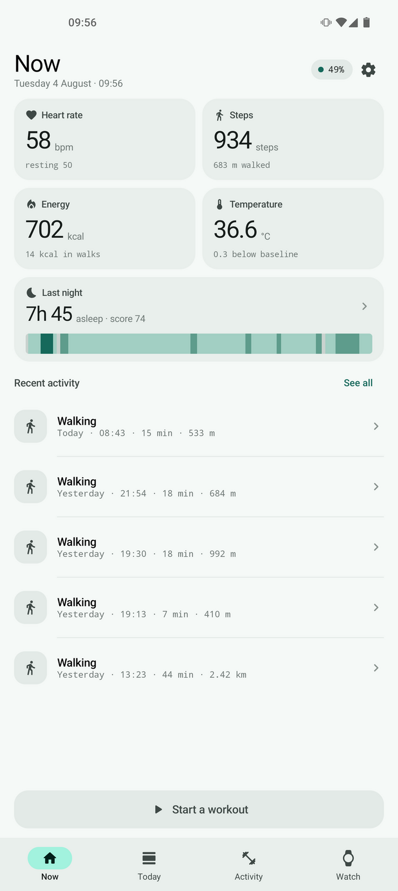
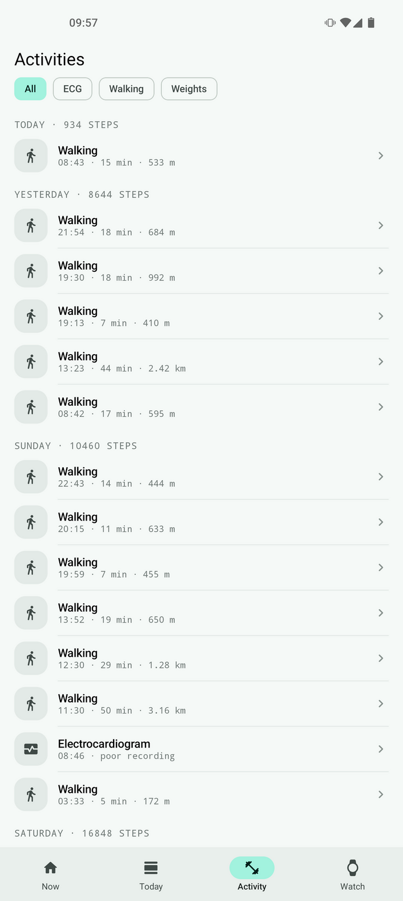
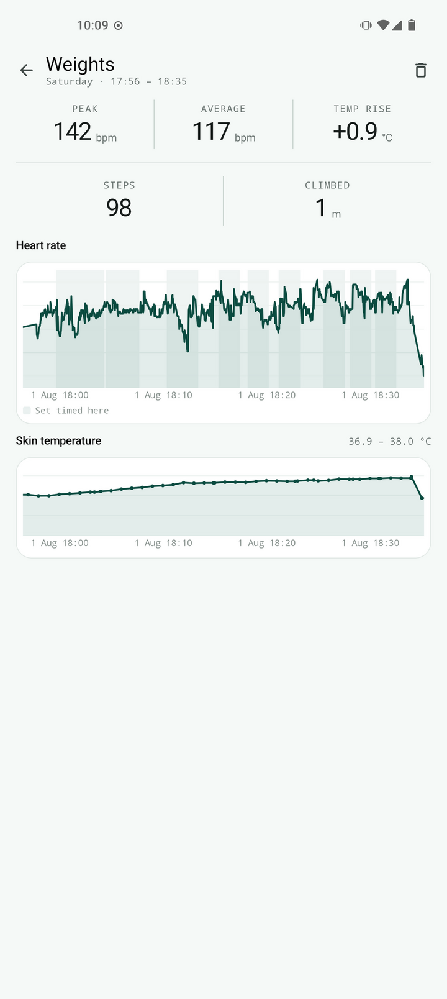
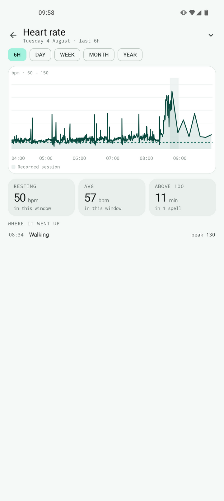
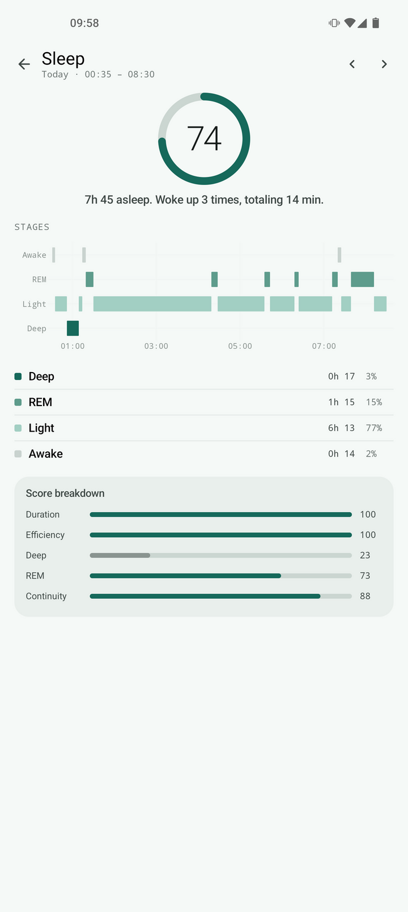
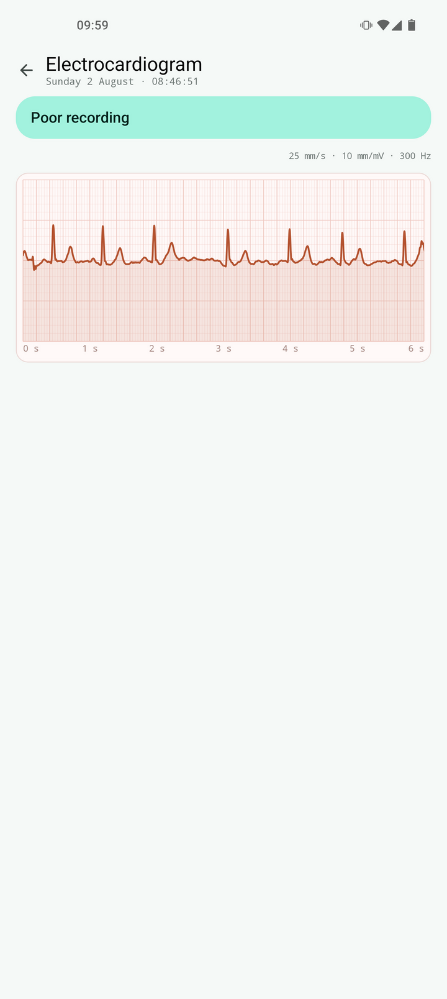
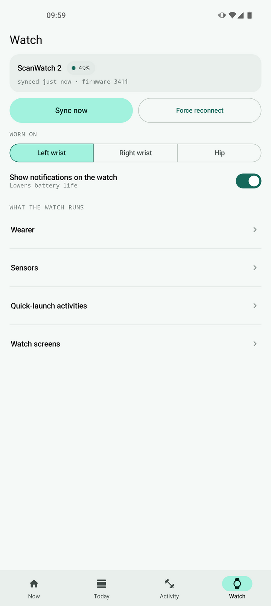

# Withings protocol app

This app handles the protocol for the Withings ScanWatch 2.

Very early in development.

Handles:

- Sensor data (Heart rate, temperature, breath rate, steps, charge state / level)
- Automatic activities (walking, running), segmentation is implemented locally instead of using the API so it's a bit different
- Manual activities (starting an activity from the watch), has a custom UI for the 'live exercise mode'
- ECG
- Most settings
- Notifications (only sends a test notification, does not forward system notifications)

## Screenshots

<table>
  <tr>
    <td></td>
    <td></td>
    <td></td>
    <td></td>
  </tr>
  <tr>
    <td></td>
    <td></td>
    <td></td>
    <td></td>
  </tr>
</table>

Notes:

- Protocol reverse engineered from app decompile / .so decompile / firmware disassembly
- Enabling notifications lowers battery life (estimated to 20 days instead of 30~35)

# DEBUG DATA

There's a stream of `DEBUG` data which holds some "unknown" data at a high sampling rate (mostly 1 Hz), which are not used for anything as far as I'm aware

- Maybe 1Hz acceleromter
- unknown
- unknown
- 1Hz Temperature

It also has a debug log and the watch settings' database.

On the original app, this data is sent straight to withings. I'm not sure why they need 1Hz raw sensor data but I don't like it.
