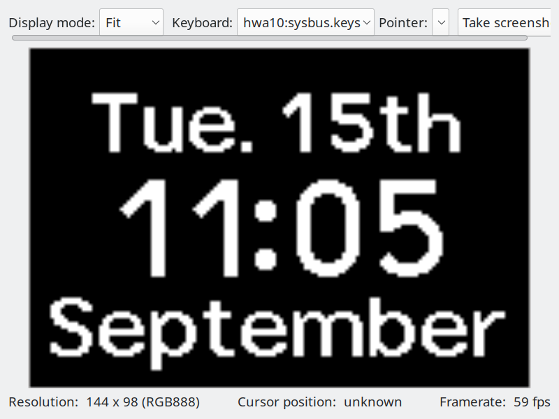

# Renode simulation of the ScanWatch 2 (HWA10)

It simulates the main SoC (nRF52840) running the three images in flash

- Nordic's MBR (forwards interrupts and SVCs)
- S140 SoftDevice (Nordic's BLE stack and SoC services)
- The application



All the main sensors are modelled

| device | bus / pins |
|---|---|
| MX25R6435F SPI flash | SPIM2 (0x40023000), CS P0.15 |
| ADXL367 accelerometer | SPIM2, CS P0.16, INT1 P0.27 |
| MAX86173 optical HR front end | SPIM1 (0x40004000), CS P0.26, INT P1.14 |
| SSD1320 OLED 144x98 | SPIM3 (0x4002F000), D/C P1.09 |
| BQ25180 charger | TWI0 (0x40003000) 0x6A |
| PAT9125 crown | TWI0 0x79, MOTION P1.13 |
| crown click | GPIO P1.11, active low |
| TMP117 skin temperature | TWI0 0x48 |
| ADS1115-class heat-flux ADC | TWI0 0x49 |
| APDS-9306 ambient light | TWI0 0x52 |
| MS5849 barometer | TWI0 0x77 |
| battery sense | SAADC AIN0 |
| hour, minute and tracker hands | PWM1 P1.2/P1.5/P1.6, PWM0 P1.1/P1.4/P1.7, PWM2 P1.3/P0.9/P0.10 |

There are some hacks to patch over Renode, i'd like to upstream them at some point.

The simulator can run faster than real time so it's usable for development; there's a BLE
to-socket adapter so that the simulator can talk to the rust code implementing the protocol.


## Dependencies

  - Renode 1.17
  - llvm-objdump/llvm-objcopy and python3
  - Firmware file for v3411
  - A dump of the SPI flash
  - [NRF52840.svd](https://dl.antmicro.com/projects/renode/svd/NRF52840.svd.gz)

## How to run

Once, extract the 'partitions' from the package with `extract.py`

Before each run, resolve the memory patches and hooks the rig needs against the
image it is about to load, which writes `out/rig/`:

```bash
python3 abi/rig.py                                     # the stock flash.bin
python3 abi/rig.py --image out/flash-relinked.bin --symbols out/relink/relinked.elf
```

Batch run (headless, 60 s of virtual time in ~15 s, output in `out/`):

```bash
renode --disable-xwt --console -e "include @scripts/display-run.resc" < <(sleep 1000)
```

Renode's RAM reads as zero at reset and real SRAM does not, so `$ramfill` brings
the app RAM up holding one byte instead, which is what a cold power-on gives the
watch; `abi/check.sh` runs two of its configurations that way as `RAMFILL=ff`:

```bash
renode --disable-xwt --console -e '$ramfill="ff"' \
    -e "include @scripts/display-run.resc" < <(sleep 1000)
```

Interactive run:

```bash
renode --console --port 12345 -e "include @scripts/live.resc"
printf 'keys Tap "Enter"\n' | nc -q 1 localhost 12345
printf 'twi0.crown Rotate 1\n' | nc -q 1 localhost 12345
```

To validate the network protocol via TCP:

```bash
renode --disable-xwt --console -e "include @scripts/wpp-pipe.resc" < <(sleep 1000)
cargo run -p wpp-sim-client -- --secret-from-dump external_flash.bin   # once out/uart0.log shows "Add WPPS chars."
```

The same pipe serves ANCS on the next port, where the watch is the GATT client, so
a notification goes in over that:

```bash
cargo run -p wpp-sim-client -- --secret-from-dump external_flash.bin \
    --notification "Hello watch|ANCS works" --app dev.davidv.withoutings --dismiss 1
```

There's a hardcoded 30s start-up delay on the firmware, `scripts/live.resc` patches that out.

If you want to render the screen capture .bin files to png:

```bash
python3 render_png.py --w 144 --h 98 --fmt gray4 out/frames/frame400.bin out/frame400.png
```

## Building a relinked image

Every script under `abi/` documents itself in its header comment; this is the
order they run in. Everything below runs from `renode-sim/`.

```bash
abi/refbuild.sh                 # once: toolchain and reference libraries into ~/ref-build
abi/relink.sh                   # out/flash-relinked.bin and out/relink/relinked.elf
abi/identity.sh                 # the relink reproduces the stock app byte for byte
abi/check.sh                    # every configuration: link, identity, stale scan, 60 s boot diff
```

`relink.sh` and `check.sh` take their configuration from the environment:

| variable | effect |
|---|---|
| `REPLACE=a,b` | replacement groups from `abi/replacements.yaml` (`newlib`, `libm`, `get_fw_version`, `greenteg_cbta_network`, ...) |
| `DATA=1` | data as source through `abi/datagen.py`; the typed tables need it |
| `GC=1` | drop what nothing reaches |
| `PRUNE=name` | a feature from `abi/prunes.yaml` (`wpps_tls_tunnel`) |
| `LAYOUT=shift\|reverse\|pack` | move the flash sections |
| `RAM=shift\|reverse` | move the RAM items |
| `SPILL=pattern` | archives the packed layout may place in the app's span |
| `RAMFILL=ff` | (check.sh only) run with RAM prefilled, see above |

Then run it the usual way: `python3 abi/rig.py --image out/flash-relinked.bin
--symbols out/relink/relinked.elf` and the script of your choice. The map is
regenerated by its writers, in this order, whenever a rule or a header changes:

```bash
python3 abi/survey.py --emit; python3 abi/kernel_objects.py; python3 abi/globals.py
python3 abi/trace.py; python3 abi/sensors.py; python3 abi/wui_views.py
python3 abi/autonames.py; python3 abi/autonames.py      # twice: the second run proves the fixed point
python3 abi/symbols.py --check; python3 abi/coverage.py
```

`python3 abi/greenteg.py [--export model.json] [--pairs capture]` reads the
core-temperature network out of the image, exports it, and checks it against
a capture.

## Debug stuff

To read the disassembly, build it with `mkdis.sh`; it writes `out/appl.dis` and
`out/sd.dis` with absolute flash addresses, so they line up with `symbols.txt`
(the address to name map for the app, MBR and SoftDevice).

To find where the boot stalls, generate hooks for a code range with
`calltrace.py 0x2e700 0x2e900 > out/hooks.resc`, include that file in a copy of
`scripts/display-run.resc`, and look at the last function entered.

The peripheral models are the `models/Nrf*.cs` and `models/OledSpim.cs` files,
one per peripheral; the run script sets their inputs (battery volts,
temperature). The earlier bring-up scripts (`scripts/boot.resc`,
`scripts/run-logs.resc`, `scripts/trace.resc`, `scripts/logs.resc`,
`coverage.py`) still work but `scripts/display-run.resc` replaced them.
